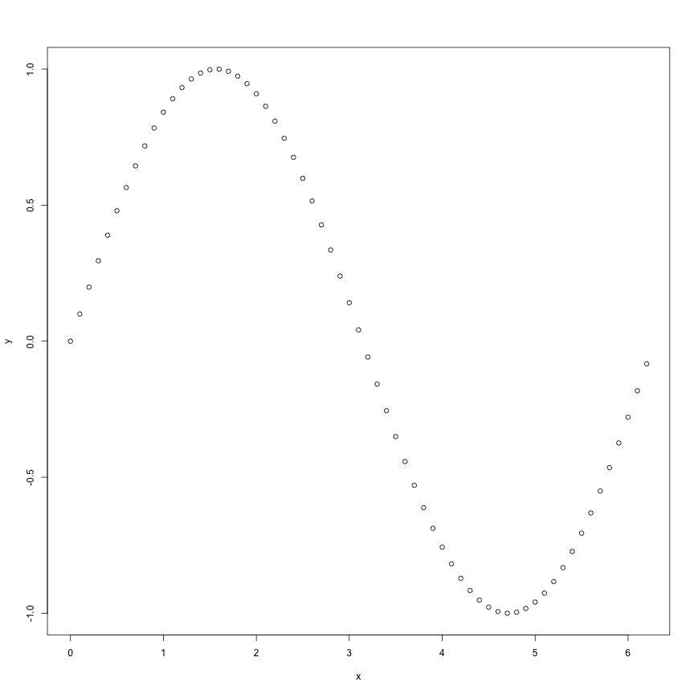
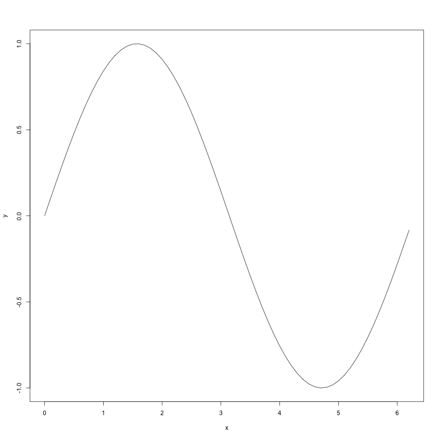
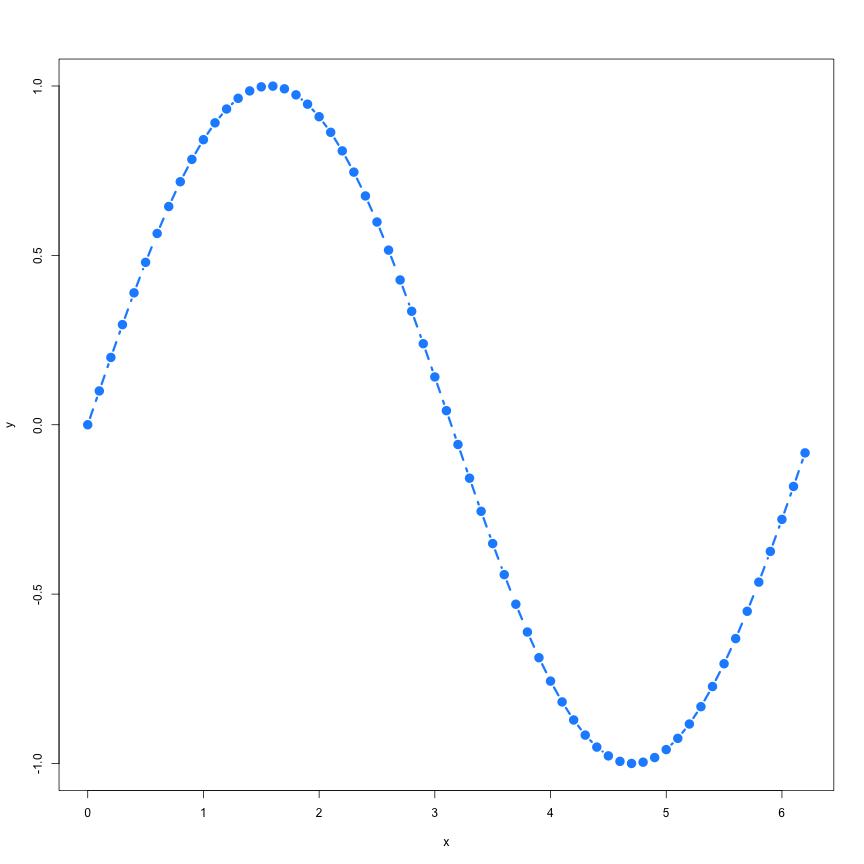
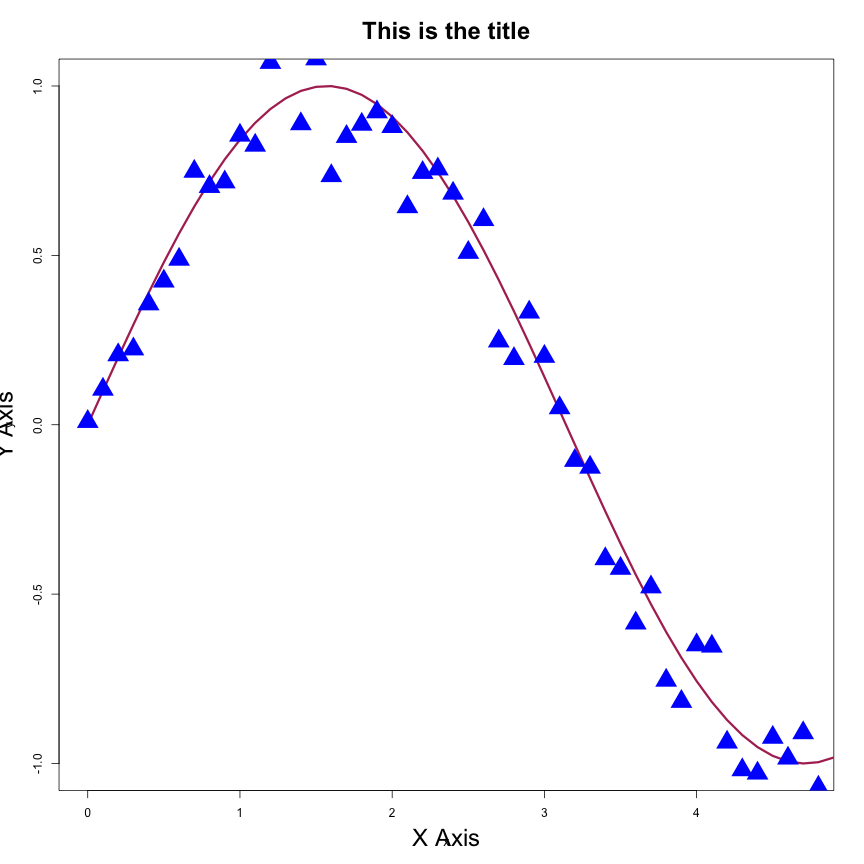
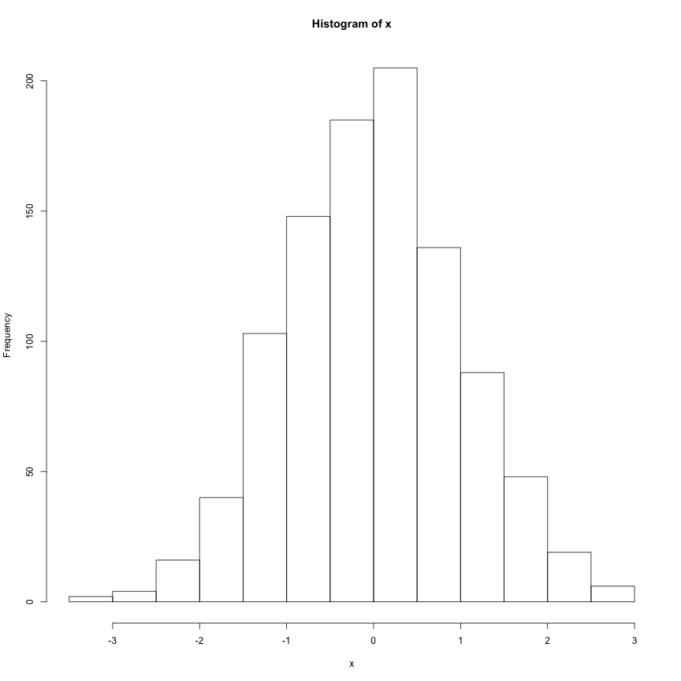
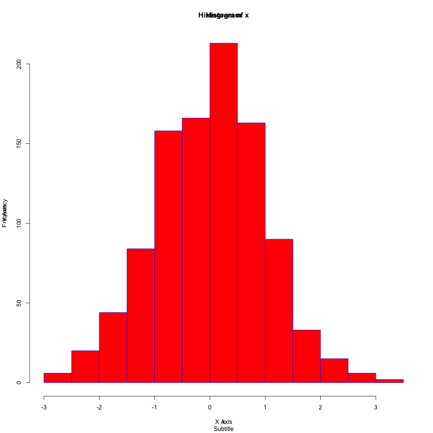

<style>
.small-code pre code {
  font-size: 1em;
}
</style>

Introduction to R
========================================================
author: Bruce Bugbee
date: August 17, 2017
autosize: true

A little about me...
========================================================

- Computational Statistician at National Renewable Energy Lab
- R user for about 10 years now
- Probably needs more coffee at the moment...

What Is R?
========================================================

***
- "R is a free software environment for statistical computing and graphics." -- www.r-project.org
- "R is, at its heart, an elegant and beautiful language, well tailored for data analysis and statistics." -- Hadley Wickham in __Advanced R__
- "R is that thing my advisor told me to use. Will you please stop bothering me and just help me with my stats?" -- Most grad students

What Is R?
========================================================

- Free, open source, and widely supported
- An object oriented programming language with historical ties to C
- Focueses on data analysis, modeling, and visualization first and foremost
- Most common research language for cutting edge statistics (fights with Python/Scala for machine learning community)

Goal of this talk
========================================================

My goal here is to provide some concrete examples of the foundational elements of R including I/O, data types, control flow, statistical modeling, and visualization.

The repo with all code, examples, and slides can be found here: [https://github.com/BruceBugbee/rmacc-hpc-2017](https://github.com/BruceBugbee/rmacc-hpc-2017)


Data Classes
========================================================
R has numerous built in classes for different data types.

- double
- integer
- character
- boolean
- factor
- Date
- DateTime
- complex
- ...

Doubles
========================================================
Standard double precision class. A historical anomaly often calls this "numeric" instead of "double".

```r
class(43)
```

```
[1] "numeric"
```

Integer
========================================================
Seldom used in most day to day R analysis. Integer classes come more into play when you are paying attention to memory issues.

```r
class(4) #numeric
```

```
[1] "numeric"
```

```r
class(4L) #integer
```

```
[1] "integer"
```

Character
========================================================
Characters are defined using double or single quotes.

```r
class("pineapple")
```

```
[1] "character"
```

```r
class("8675309")
```

```
[1] "character"
```

```r
class(8675309)
```

```
[1] "numeric"
```

Boolean
========================================================
Binary true/false objects.

```r
class(T) #two acceptable ways
```

```
[1] "logical"
```

```r
class(TRUE)
```

```
[1] "logical"
```

Four Basic Objects
========================================================
These are the four foundational data types in R. They all have a couple common methods for defining, coercing, or checking class type

Coercing objects
========================================================
All these types have functions prefaced with __as.__ that try to coerce from one type to another.


```r
as.character(100)
```

```
[1] "100"
```

```r
as.character(100L)
```

```
[1] "100"
```

```r
as.character(TRUE)
```

```
[1] "TRUE"
```

Coercing objects
========================================================


```r
as.numeric(100L)
```

```
[1] 100
```

```r
as.numeric("100")
```

```
[1] 100
```

```r
as.numeric(TRUE) #codes to 1 for True, 0 for False
```

```
[1] 1
```


Coercing objects
========================================================


```r
as.logical("TRUE")
```

```
[1] TRUE
```

```r
as.logical("T")
```

```
[1] TRUE
```

```r
as.logical("True")
```

```
[1] TRUE
```

```r
as.logical("pineapple")
```

```
[1] NA
```

Checking class
========================================================
To check whether an object is of a certain class, use the prebuilt function that has the __is.__ prefix.

```r
is.logical(TRUE)
```

```
[1] TRUE
```

```r
is.numeric(100L) #notice how numeric will pass integers with no problem
```

```
[1] TRUE
```

```r
is.double(100L)
```

```
[1] FALSE
```

```r
is.character("pineapple")
```

```
[1] TRUE
```

Data Structures
========================================================

One of the primary strengths of R is that its built in data structures are designed to handle statistical and scientific computing problems

Vectors
========================================================
Vectors are 1-dimensional collections of objects with the same class and a fixed length property.

```r
vec <- c(1, 2, 3, 4, 5, 6)
print(vec)
```

```
[1] 1 2 3 4 5 6
```

```r
vec[1]
```

```
[1] 1
```

```r
vec[0] #R indices start at 1, not 0
```

```
numeric(0)
```

```r
class(vec)
```

```
[1] "numeric"
```

Vectors
========================================================
Vectors are 1-dimensional collections of objects with the same class and a fixed length property.

```r
vec <- LETTERS[1:8]
print(vec)
```

```
[1] "A" "B" "C" "D" "E" "F" "G" "H"
```

```r
vec[1]
```

```
[1] "A"
```

```r
class(vec)
```

```
[1] "character"
```


Vectors
========================================================
The __length__ function is pretty self explanatory

```r
vec
```

```
[1] "A" "B" "C" "D" "E" "F" "G" "H"
```

```r
length(vec)
```

```
[1] 8
```


Vectors
========================================================
Subsetting and asignment is typically done through bracket notation

```r
vec <- LETTERS[1:8] #notice the shortcut for sequential vectors
vec[c(2, 3, 4)] #can index with vectors
```

```
[1] "B" "C" "D"
```

```r
vec[-1] #negative values indicate removal
```

```
[1] "B" "C" "D" "E" "F" "G" "H"
```

```r
vec2 <- vec
vec2[5] <- "ZZZZZ" #can replace elements
vec2
```

```
[1] "A"     "B"     "C"     "D"     "ZZZZZ" "F"     "G"     "H"    
```

Vectors
========================================================
Element-wise operations like addition, multiplication, etc. are easy using the normal +, *, etc. operators. 

```r
vec1 <- 1:5
vec2 <- 2:6
print(vec1)
```

```
[1] 1 2 3 4 5
```

```r
print(vec2)
```

```
[1] 2 3 4 5 6
```

```r
vec1 + vec2
```

```
[1]  3  5  7  9 11
```

```r
vec1 * vec2
```

```
[1]  2  6 12 20 30
```


Vectors
========================================================
Scalars can be applied to the entire vector

```r
vec <- 1:10
4 * vec
```

```
 [1]  4  8 12 16 20 24 28 32 36 40
```

Vectors
========================================================
Make sure vectors are the same length or weird things can happen

```r
1:2 + 1:10 #tries to do addition to subsets of the longer vector
```

```
 [1]  2  4  4  6  6  8  8 10 10 12
```

Matrices and Arrays
========================================================
Matrices and arrays are multidimensional extensions of vectors that add a __dim__ attribute.

```r
mat <- matrix(1:9, nrow = 3, ncol = 3)
mat
```

```
     [,1] [,2] [,3]
[1,]    1    4    7
[2,]    2    5    8
[3,]    3    6    9
```

```r
arr <- array(1:12, dim = c(2, 3, 2))
arr
```

```
, , 1

     [,1] [,2] [,3]
[1,]    1    3    5
[2,]    2    4    6

, , 2

     [,1] [,2] [,3]
[1,]    7    9   11
[2,]    8   10   12
```


Matrices and Arrays
========================================================
Length will still work here and the __dim__ function is now defined.

```r
arr <- array(1:12, dim = c(2, 3, 2))
length(arr) #total # of elements
```

```
[1] 12
```

```r
dim(arr)
```

```
[1] 2 3 2
```


Matrices and Arrays
========================================================
Subsetting is handled through square brackets with the use of commas to distinguish dimension

```r
mat <- matrix(1:12, nrow = 4, ncol = 3)
mat
```

```
     [,1] [,2] [,3]
[1,]    1    5    9
[2,]    2    6   10
[3,]    3    7   11
[4,]    4    8   12
```

```r
mat[2:3, ] #leaving a column emtpy indicates all values of that dimension
```

```
     [,1] [,2] [,3]
[1,]    2    6   10
[2,]    3    7   11
```

```r
mat[-1, 2] #one dimensional subsets will be reduced to vectors automatically
```

```
[1] 6 7 8
```

Matrices and Arrays
========================================================
Subsetting is handled through square brackets with the use of commas to distinguish dimension

```r
arrarr <- array(1:12, dim = c(2, 3, 2))
arr
```

```
, , 1

     [,1] [,2] [,3]
[1,]    1    3    5
[2,]    2    4    6

, , 2

     [,1] [,2] [,3]
[1,]    7    9   11
[2,]    8   10   12
```

```r
arr[1, 1, 1] #single element
```

```
[1] 1
```

```r
arr[1, 2:3, 1:2] #matrix
```

```
     [,1] [,2]
[1,]    3    9
[2,]    5   11
```

Matrices and Arrays
========================================================
Elementwise operations still work by default.

```r
mat1 <- matrix(1:9, nrow = 3, ncol = 3)
mat2 <- t(mat1) #transpose
mat1 + mat2
```

```
     [,1] [,2] [,3]
[1,]    2    6   10
[2,]    6   10   14
[3,]   10   14   18
```

```r
mat1 * mat2
```

```
     [,1] [,2] [,3]
[1,]    1    8   21
[2,]    8   25   48
[3,]   21   48   81
```

Matrices and Arrays
========================================================
Make sure dimensions match up

```r
mat1 <- matrix(1:9, nrow = 3, ncol = 3)
mat2 <- matrix(1:6, nrow = 2, ncol = 3)
mat1 + mat2 #will break
```


Matrices and Arrays
========================================================
Matrix multiplication is defined with the __%*%__ operator

```r
mat1 <- matrix(1:9, nrow = 3, ncol = 3)
mat2 <- matrix(1:6, nrow = 2, ncol = 3)
mat2 %*% mat1
```

```
     [,1] [,2] [,3]
[1,]   22   49   76
[2,]   28   64  100
```


Lists
========================================================
Lists are 1-dimensional collections of heterogenous objects.

```r
lis <- list(x = 1, y = LETTERS[1:5], z = matrix(1:9, 3, 3))
lis
```

```
$x
[1] 1

$y
[1] "A" "B" "C" "D" "E"

$z
     [,1] [,2] [,3]
[1,]    1    4    7
[2,]    2    5    8
[3,]    3    6    9
```

Lists
========================================================
Lists can be subsetted multiple ways

```r
lis[[2]] #access element of the list
```

```
[1] "A" "B" "C" "D" "E"
```

```r
lis$y #access element of the list
```

```
[1] "A" "B" "C" "D" "E"
```

```r
lis["y"] #sub-list structure
```

```
$y
[1] "A" "B" "C" "D" "E"
```

Data Frames
========================================================
Data frames are a native 2-D tabular data object where each column can be a different type. These structures are the workhorses of much of R's data analysis ecosystem. They are very similar to pandas objects in Python.


Data Frames
========================================================


```r
x <- data.frame(A = 1:10, B = "hello", 
                C = seq.Date(from = Sys.Date(), length = 10, by = "day"))
x
```

```
    A     B          C
1   1 hello 2017-08-17
2   2 hello 2017-08-18
3   3 hello 2017-08-19
4   4 hello 2017-08-20
5   5 hello 2017-08-21
6   6 hello 2017-08-22
7   7 hello 2017-08-23
8   8 hello 2017-08-24
9   9 hello 2017-08-25
10 10 hello 2017-08-26
```

Data Frames
========================================================


```r
summary(x)
```

```
       A             B            C             
 Min.   : 1.00   hello:10   Min.   :2017-08-17  
 1st Qu.: 3.25              1st Qu.:2017-08-19  
 Median : 5.50              Median :2017-08-21  
 Mean   : 5.50              Mean   :2017-08-21  
 3rd Qu.: 7.75              3rd Qu.:2017-08-23  
 Max.   :10.00              Max.   :2017-08-26  
```

Data Frames
========================================================
Data frames are typically subsetted like matrices or lists

```r
x[,1]
```

```
 [1]  1  2  3  4  5  6  7  8  9 10
```

```r
x$A
```

```
 [1]  1  2  3  4  5  6  7  8  9 10
```

Data Frames
========================================================
Data frames are the standard structure for the __tidyverse__ ecosystem of packages which include

- dplyr
- tidyr
- ggplot2
- purrr
- ... 

This is my prefered analysis pipeline and am giving a talk on it next!

Special Classes and Objects of Note
========================================================
As an object oriented programming language, you can define your own custom classes and data objects. Here are few special ones that show up a lot:

Factors
========================================================
Factors are character vectors with a fixed set of members/levels. This is particularly useful for categorical data.


```r
vec <- c("Denver", "Fort Collins", "Arvada", "Boulder")
factor(vec)
```

```
[1] Denver       Fort Collins Arvada       Boulder     
Levels: Arvada Boulder Denver Fort Collins
```

Factors
========================================================
Factors also have the ability to __ordered__. This allows you to map an ordering to non-numeric data.


```r
vec <- c("Denver", "Fort Collins", "Arvada", "Boulder")
factor(vec, ordered = T) #defaults to alphabetical
```

```
[1] Denver       Fort Collins Arvada       Boulder     
Levels: Arvada < Boulder < Denver < Fort Collins
```

```r
factor(vec, ordered = T, levels = c("Denver", "Boulder", "Arvada", "Fort Collins"))
```

```
[1] Denver       Fort Collins Arvada       Boulder     
Levels: Denver < Boulder < Arvada < Fort Collins
```

Factors
========================================================
Just like with other classes, the __is__ and __as__ functions are useful here

```r
vec <- c("Denver", "Fort Collins", "Arvada", "Boulder")
factor_vec <- factor(vec, ordered = T) #defaults to alphabetical
factor_vec
```

```
[1] Denver       Fort Collins Arvada       Boulder     
Levels: Arvada < Boulder < Denver < Fort Collins
```

```r
as.character(factor_vec)
```

```
[1] "Denver"       "Fort Collins" "Arvada"       "Boulder"     
```

Factors
========================================================
Be very careful when coercing to numeric!

```r
vec <- c("1", "2", "100", "4")
factor_vec <- factor(vec) #defaults to alphabetical
factor_vec
```

```
[1] 1   2   100 4  
Levels: 1 100 2 4
```

```r
as.numeric(factor_vec)
```

```
[1] 1 3 2 4
```

```r
as.numeric(as.character(factor_vec))
```

```
[1]   1   2 100   4
```

Factors
========================================================
Factors become extremely useful when partitioning and manipulating larger data sets and visualizing groups. Check out the __forcats__ package for some better helper functions for factors

Date
========================================================
__Date__ is a built in class for handling year, month, and day information

```r
date <- Sys.Date()
class(date)
```

```
[1] "Date"
```

```r
date
```

```
[1] "2017-08-17"
```


Date
========================================================
Really useful when you have multiple observations over time

```r
date <- Sys.Date()
date
```

```
[1] "2017-08-17"
```

```r
date + 3 #adds 3 days
```

```
[1] "2017-08-20"
```

Date
========================================================
Really useful when you have multiple observations over time. Make sure to keep track of units!

```r
date1 <- Sys.Date()
date2 <- date1 + 3
date2 - date1
```

```
Time difference of 3 days
```

```r
class(date2 - date1) #notice the difftime class
```

```
[1] "difftime"
```

```r
as.numeric(date2 - date1)
```

```
[1] 3
```

Date
========================================================
Can handle a lot of different date formats, etc.

```r
as.Date("2017-08-16")
```

```
[1] "2017-08-16"
```

```r
as.Date("2017/08/16")
```

```
[1] "2017-08-16"
```

```r
as.Date("August 16, 2017", format = "%B %d, %Y") #uses the strptime function to handle format
```

```
[1] "2017-08-16"
```

POSIX
========================================================
Date-time objects that extend Date to handle hour, minute, second information as well as timezones.

```r
Sys.time()
```

```
[1] "2017-08-17 00:28:27 MDT"
```

```r
class(Sys.time())
```

```
[1] "POSIXct" "POSIXt" 
```

```r
#POSIXct represents seconds since Unix epoch + other stuff
#POSIXlt stores list of year, month, day, hour, minute, sec + other stuff
```

POSIX
========================================================

```r
as.POSIXct("2017-08-16")
```

```
[1] "2017-08-16 MDT"
```

```r
as.POSIXct("2017-08-16") + 60 #Defaults to adding seconds
```

```
[1] "2017-08-16 00:01:00 MDT"
```

```r
(as.POSIXct("2017-08-16") + 60) - (as.POSIXct("2017-08-16"))
```

```
Time difference of 1 mins
```

POSIX
========================================================
Check out the __zoo__ and __lubridate__ packages for more advanced Date and POSIX functionality


Visualization
========================================================
Out of the box R is one of the easiest and most powerful visualization systems for data. Lots of standard visualizations are already implemented and only require a couple of lines. Customization and more advanced use cases can be handled through clever coding and flexible plotting options.

The plot() function
========================================================
class: small-code

```r
x <- seq(0, 2*pi, by = 0.1)
y <- sin(x)
plot(x, y)
```
***



The plot() function
========================================================
class: small-code

```r
x <- seq(0, 2*pi, by = 0.1)
y <- sin(x)
plot(x, y, type = "l")
```
***



The plot() function
========================================================
class: small-code

```r
x <- seq(0, 2*pi, by = 0.1)
y <- sin(x)
plot(x, y, type = "b", col = "dodgerblue", lty = 2, lwd = 3, pch = 20, cex = 2)
```
***



The plot() function
========================================================
class: small-code
Can call an empty plot device and manually add elements

```r
x <- seq(0, 2*pi, by = 0.1)
y <- sin(x)
noise <- jitter(y) 
plot(x, y, type = "n", xlim = c(0, 1.5*pi))
lines(x, y, col = "maroon", lwd = 3)
points(x, noise, col = "pink", pch = 12)
title(main = "This is the title", xlab = "X Axis", ylab = "Y Axis",
      cex.main = 2)
```
***


The hist() function
========================================================
class: small-code
Histograms are common ways to visualize distributions of data

```r
x <- rnorm(1000) #random normal data
hist(x)
```
***


The hist() function
========================================================
class: small-code
Can manipulate just like other plots

```r
x <- rnorm(1000) #random normal data
title(main = "Histogram", sub = "Subtitle", xlab = "X Axis", ylab = "Y Axis")
```
***


Tons of other graphics built in
========================================================
- Bar charts
- Pie Charts
- Box plots
- Many advanced objects (regression models, time series, etc.) and objects have custom plotting methods defined for them that automatically produce one or more plots of interest


Data Import and Output
========================================================
R is __extremely__ flexible when it comes to importing data and it is constantly being extended. A few examples of methods that are included in base R or added through common packages.

- tabular data (csv, tsv, etc.)
- text files
- JSON
- database connections (SQL, Access, Mongo, pretty much anything you can think of)
- Web APIs (httr package really good here)
- "Big Data" frameworks (Hadoop, Spark, etc.)

In my practical experience, data import almost always boils down to tabular flat files like csvs. Databases are next most common. Obviously this depends on your use case.


Tabular Data Import
========================================================
__read.delim__ is the work horse base R function for reading in data. Both __read.csv__ and __read.tsv__ are special cases of this function.


```r
dat <- read.delim(file = "./2015_fuel_econ.csv", header = T, sep = ",")
class(dat)
```

```
[1] "data.frame"
```

```r
head(dat)
```

```
  X    id  make      model year                           class
1 1 34839 Acura    RDX 2WD 2015 Small Sport Utility Vehicle 2WD
2 2 34843 Acura    RDX 4WD 2015 Small Sport Utility Vehicle 4WD
3 3 34771  Audi         A3 2015                 Subcompact Cars
4 4 34710  Audi A3 quattro 2015                 Subcompact Cars
5 5 34925  Audi         A8 2015                    Midsize Cars
6 6 34926  Audi         A8 2015                    Midsize Cars
           trans             drive cyl displ    fuel hwy cty
1 Automatic (S6) Front-Wheel Drive   6   3.5 Premium  28  20
2 Automatic (S6)   All-Wheel Drive   6   3.5 Premium  27  19
3    Auto(AM-S6) Front-Wheel Drive   4   2.0 Premium  33  23
4    Auto(AM-S6)   All-Wheel Drive   4   1.8 Premium  33  24
5 Automatic (S8)   All-Wheel Drive   8   4.0 Premium  30  18
6 Automatic (S8)   All-Wheel Drive   6   3.0 Premium  29  19
```

Tabular Data Import
========================================================
__summary__ is a very useful function for dataframes

```r
dat <- read.delim(file = "./2015_fuel_econ.csv", header = T, sep = ",")
summary(dat)
```

```
       X             id             make             model    
 Min.   :  1   Min.   :34644   BMW    :36   A8 L        :  4  
 1st Qu.: 52   1st Qu.:34705   MINI   :34   6           :  3  
 Median :103   Median :34823   Volvo  :18   CX-5 2WD    :  3  
 Mean   :103   Mean   :34801   Jaguar :13   Fit         :  3  
 3rd Qu.:154   3rd Qu.:34878   Audi   :11   Forester AWD:  3  
 Max.   :205   Max.   :34932   Mazda  :11   MX-5        :  3  
                               (Other):82   (Other)     :186  
      year                                  class                trans   
 Min.   :2015   Compact Cars                   :40   Automatic (S8) :56  
 1st Qu.:2015   Two Seaters                    :31   Automatic (S6) :47  
 Median :2015   Large Cars                     :22   Manual 6-spd   :31  
 Mean   :2015   Subcompact Cars                :21   Automatic 6-spd:25  
 3rd Qu.:2015   Small Sport Utility Vehicle 4WD:20   Auto(AM-S7)    : 7  
 Max.   :2015   Midsize Cars                   :18   Automatic 8-spd: 6  
                (Other)                        :53   (Other)        :33  
               drive         cyl             displ      
 4-Wheel Drive    :15   Min.   : 4.000   Min.   :1.200  
 All-Wheel Drive  :67   1st Qu.: 4.000   1st Qu.:2.000  
 Front-Wheel Drive:61   Median : 6.000   Median :3.000  
 Rear-Wheel Drive :62   Mean   : 5.824   Mean   :3.212  
                        3rd Qu.: 8.000   3rd Qu.:4.400  
                        Max.   :12.000   Max.   :6.800  
                        NA's   :1        NA's   :1      
                         fuel          hwy             cty        
 Diesel                    :  3   Min.   : 18.0   Min.   : 11.00  
 Electricity               :  1   1st Qu.: 24.0   1st Qu.: 16.00  
 Gasoline or E85           : 13   Median : 28.0   Median : 20.00  
 Premium                   :127   Mean   : 28.6   Mean   : 20.81  
 Premium Gas or Electricity:  1   3rd Qu.: 32.0   3rd Qu.: 25.00  
 Premium or E85            :  3   Max.   :101.0   Max.   :126.00  
 Regular                   : 57                                   
```

Tabular Data Import
========================================================
__glimpse__ is a useful alternative for quick inspection

```r
dat <- read.delim(file = "./2015_fuel_econ.csv", header = T, sep = ",")
dplyr::glimpse(dat) 
```

```
Observations: 205
Variables: 13
$ X     <int> 1, 2, 3, 4, 5, 6, 7, 8, 9, 10, 11, 12, 13, 14, 15, 16, 1...
$ id    <int> 34839, 34843, 34771, 34710, 34925, 34926, 34928, 34929, ...
$ make  <fctr> Acura, Acura, Audi, Audi, Audi, Audi, Audi, Audi, Audi,...
$ model <fctr> RDX 2WD, RDX 4WD, A3, A3 quattro, A8, A8, A8 L, A8 L, A...
$ year  <int> 2015, 2015, 2015, 2015, 2015, 2015, 2015, 2015, 2015, 20...
$ class <fctr> Small Sport Utility Vehicle 2WD, Small Sport Utility Ve...
$ trans <fctr> Automatic (S6), Automatic (S6), Auto(AM-S6), Auto(AM-S6...
$ drive <fctr> Front-Wheel Drive, All-Wheel Drive, Front-Wheel Drive, ...
$ cyl   <int> 6, 6, 4, 4, 8, 6, 8, 12, 6, 6, 8, 4, 4, 4, 4, 6, 4, 6, 6...
$ displ <dbl> 3.5, 3.5, 2.0, 1.8, 4.0, 3.0, 4.0, 6.3, 3.0, 3.0, 4.0, 2...
$ fuel  <fctr> Premium, Premium, Premium, Premium, Premium, Premium, P...
$ hwy   <int> 28, 27, 33, 33, 30, 29, 29, 22, 36, 29, 27, 31, 31, 34, ...
$ cty   <int> 20, 19, 23, 24, 18, 19, 18, 14, 24, 19, 17, 22, 22, 23, ...
```

Output
========================================================
For every input data format there typically is an equivalent output format. The __write__ functions for tabular data are the most common functions here.


```r
x <- matrix(1:9, 3, 3)
x_df <- as.data.frame(x)
write.csv(x, file = "x.csv") #takes either matrix or array
write.csv(x_df, file = "x_df.csv")
```

RData Objects
========================================================
You can save multiple objects as a single RData object using the __save__ function. When you load these objects back into R, they will be the same as before. No extraction required


```r
x <- matrix(1:9, 3, 3)
y <- LETTERS[1:9]
z <- "pineapple"
save(x, y, z, file = "test_objects.RData")
rm(list = ls()) #clears my workspace
load("test_objects.RData") #Everything is back to normal
x
```

```
     [,1] [,2] [,3]
[1,]    1    4    7
[2,]    2    5    8
[3,]    3    6    9
```

RData Objects
========================================================
The concept of "saving your workspace" does this for everything in memory at the time of saving.

Statistics
========================================================
How have we gotten this far into an R talk without talking about a ton of statistics!? The built in data structures and visualization capabilities of R make it the go to for the current generation of statistical research (not to mention that it is free). Here are a few things it is good at out of the box or with common packages:

- Simple statistical models (linear regression, ANOVA, logistic regression, etc.)
- Generating random data according to distributions (Normal, Exponential, Poisson, etc.)
- Statistical tests (t-tests, Chi Squared, etc.)
- Tons more...

Rather than give a lecture on statistics, I thought I would do a few demos of using all of R's functionality to answer some statistical questions about data. (See the attached scripts)
